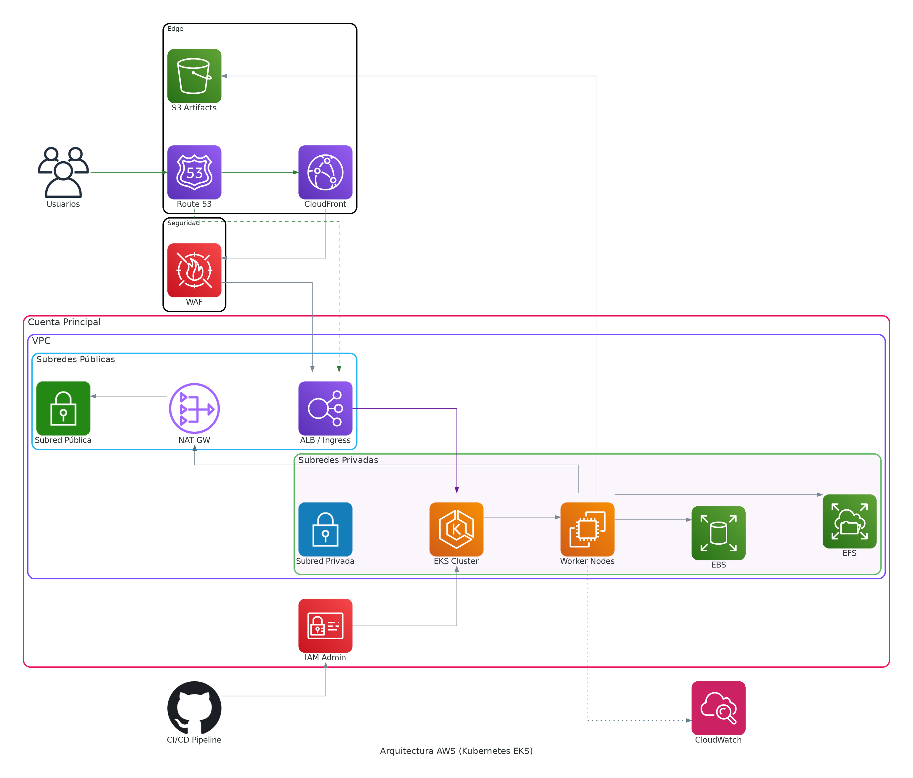

# 🛡️ MLOps – Real-Time Credit Card Fraud Detection (v2)

  <!-- Lenguaje / Core -->
  

  <!-- Data & ML -->
  
  
  
  

  <!-- Streaming -->
  
  

  <!-- Containers & Orchestration -->
  
  
  

  <!-- Infrastructure as Code -->
  

  <!-- AWS Networking -->
  
  
  
  

  <!-- AWS Storage -->
  
  

  <!-- Security & Access -->
  
  

  <!-- CI/CD -->
  

## 📌 ¿Qué es este proyecto?

Este proyecto implementa un **sistema de detección de fraude en tiempo real**, enfocado en **producción**, no en notebooks.  
El objetivo no es solo entrenar un modelo, sino **demostrar cómo llevar un modelo de Machine Learning a un entorno distribuido, reproducible y escalable**, usando prácticas reales de MLOps.

El sistema:
- Genera **transacciones sintéticas en streaming**
- Entrena periódicamente un modelo de fraude
- Versiona modelos y artefactos
- Hace **inferencia en tiempo real** sobre nuevas transacciones
- Publica predicciones a un tópico de salida

Todo esto funciona en:
- Local (Docker Compose)
- Kubernetes local
- AWS EKS (infra con Terraform + deploy con GitHub Actions)

---

## 🔁 Flujo funcional del sistema (end-to-end)

1. **Producer de transacciones**
   - Genera transacciones **100% sintéticas** (fraude y no fraude).
   - Simula patrones reales: card testing, account takeover, anomalías geográficas, etc.
   - Publica eventos en **Kafka (Confluent Cloud)** mediante un CAPCAP producer.
   - Esto se mantiene en local puesto que simula entradas externas de datos, no tiene sentido ponerlo en el cluster de EKS

2. **Entrenamiento orquestado con Airflow**
   - Un DAG corre periódicamente y:
     - Consume datos históricos desde Kafka
     - Preprocesa y entrena un **modelo XGBoost**
     - Registra métricas y artefactos en **MLflow**
   - El modelo entrenado se guarda en **storage persistente** (PVC / EFS / S3).

3. **Serving / Inferencia en tiempo real**
   - Un pod de inferencia está **escuchando continuamente** el tópico de entrada.
   - Cada nuevo evento recibido:
     - Carga el **modelo más reciente**
     - Ejecuta inferencia en baja latencia
     - Publica el resultado en un **tópico de salida (`fraud_predictions`)**

4. **Ciclo continuo**
   - El modelo se reentrena automáticamente.
   - La inferencia siempre usa la versión más nueva.
   - Todos los experimentos quedan trazables.

**Pipeline resumido:**

  - Producer → Kafka (transactions)
  - Airflow (training DAG)
  - MLflow (model registry + artifacts in Postgres)
  - Inference Pod → (fraud_predictions)

---

## 📊 Métricas actuales y contexto

- Precisión aproximada: **~0.80**
- Recall aproximado: **~0.44**

Estas métricas **no son el foco principal del proyecto**.

### ¿Por qué?
- Los datos son **sintéticos**, no reales.
- El fraude real tiene patrones mucho más consistentes.
- Existe **desbalance de clases** y ruido intencional.

El objetivo aquí es demostrar:
- Retraining automático
- Inferencia en streaming
- Versionado y trazabilidad
- Escalabilidad y operación real

Aun así, el pipeline soporta:
- Oversampling / SMOTE
- Class weights
- Hyperparameter tuning

---

## 🧠 Decisiones técnicas clave (y por qué importan)

### XGBoost
- Excelente rendimiento en datos tabulares.
- Inferencia rápida (baja latencia).
- No requiere GPU.
- Ideal bajo **restricciones de CPU**.

Elegí XGBoost porque una red neuronal:
- Requeriría más cómputo
- No aporta ventaja clara en este dataset
- Complica serving innecesariamente

---

### Kubernetes multinodo (>3 nodos)
- Cada nodo tiene recursos limitados (≈2 CPU, 8GB RAM).
- Un solo nodo **no alcanza** para Airflow + Spark + Inference.
- Se opta por **escalado horizontal**:
  - Varias instancias pequeñas
  - Suma de CPU y memoria
  - Arquitectura distribuida real

Esto refleja un escenario real:
> No siempre puedes pagar una máquina grande, pero sí varias pequeñas. En este caso, se uso el Free Tier de AWS por lo que una maquina con más poder computacional no estaba disponible, se usaron instancias m7i-flex.large

---

### Airflow + GitHub Sync
- El Helm Chart de Airflow está **poco documentado**.
- Requirió prueba y error para:
  - Variables de entorno
  - Secrets
  - GitHub Sync
- Una vez resuelto:
  - DAGs versionados
  - Deploy reproducible
  - Mismo enfoque aplicado al pod de inferencia
- Se evita `port-forward` (mala práctica en producción).

---

### MLflow (seguridad y exposición)
- MLflow 3.x impone validaciones estrictas de host/origin.
- Se configuró explícitamente para:
  - Evitar accesos no autorizados
  - Exponer solo vía Ingress
- Se evita `port-forward` (mala práctica en producción).

---

### Infraestructura como código (Terraform)
- VPC, EKS, EFS, S3, IRSA, add-ons
- IAM mínimo necesario:
  - Roles separados
  - Role asumible por GitHub Actions
- Infra **destruible y reproducible**

⚠️ Nota: algunos LoadBalancers creados por Ingress deben eliminarse manualmente si no están bajo Terraform.

---

## Arquitectura

## 📈 Observabilidad y performance

- Latencia de inferencia: **baja**
- Monitoring básico con **MetricServer** para determinar la cantidad de nodos necesarios
- No se instaló Grafana/Prometheus por simplicidad
  - Añadirlos es trivial (Helm)
- El sistema demostró:
  - Flujo continuo
  - Consumo real de Kafka
  - Predicciones en tiempo real

---

## 🌱 Escalabilidad y extensiones posibles

Este proyecto **no está cerrado**. Puede evolucionar fácilmente:

- HPA para inference y Airflow workers
- Dashboards en tiempo real (Kafka → Web App)
- Monitoreo de métricas de modelo (drift, recall over time)
- Monitoreo usando Grafana + Prometheus
- Model selection automático
- Más productores / mayor throughput
- Charts Helm propios
- Usar Karpenter para escalado de nodos

---

## 🎯 Filosofía del proyecto

Este proyecto **no busca ser un Kaggle notebook**.

Busca demostrar:
- Cómo pensar en **ML en producción**
- Cómo manejar **limitaciones reales de cómputo**
- Cómo diseñar sistemas **reentrenables, escalables y trazables**
- Cómo llevar un modelo desde local → Kubernetes → EKS

---

## 👤 Autor

**Jorge Ángel Manzanares Cortés**

Proyecto basado en el tutorial [Build a Fraud Detection AI from Scratch – CodeWithYu](https://www.youtube.com/watch?v=BY26sqZLi3k), adaptado y extendido para:
- Airflow 3.x
- Spark 4.0.1
- MLflow 3.x
- Kubernetes multinodo
- AWS EKS + Terraform
